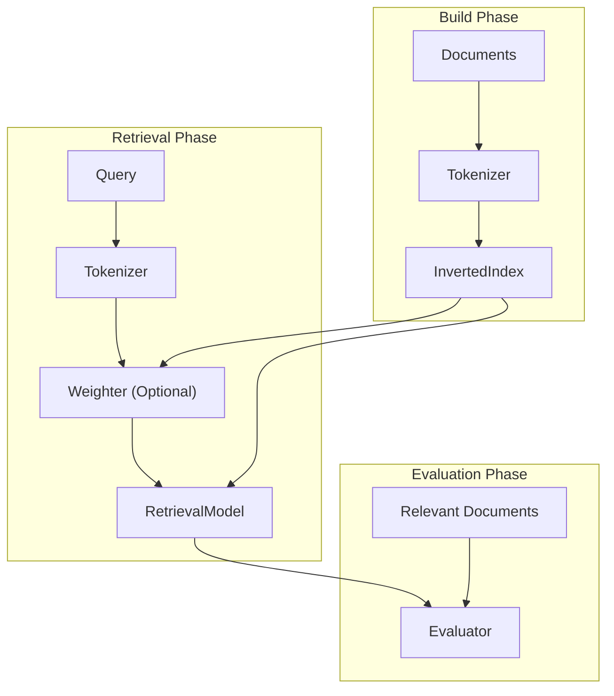

# CISI IR System

## Overview

This project implements a modular Information Retrieval (IR) system using the CISI dataset.

The system builds a field-aware inverted index and supports multiple retrieval models, including:

- Boolean Model (exact match retrieval)
- TF-IDF based Vector Space Model (ranked retrieval with cosine similarity)

It also includes an evaluation pipeline to measure retrieval performance using standard IR metrics.

## Documentation

- [Architecture](docs/architecture.md)
- [Interface Specification](docs/interface_specification.md)

## Dataset
- [CISI Dataset (Kaggle)](https://www.kaggle.com/datasets/dmaso01dsta/cisi-a-dataset-for-information-retrieval)
- [English Stopwords (Kaggle)](https://www.kaggle.com/datasets/amirhoseinsedaghati/english-stopwords)

## What This Project Does

- Builds a field-aware inverted index (title and body)
- Tokenizes and preprocesses documents and queries
- Computes TF-IDF weights for documents and queries
- Performs retrieval using:
  - Boolean Model
  - Vector Space Model (cosine similarity)
- Retrieves top-k relevant documents
- Provides term-level contribution for result explanation (VSM)
- Evaluates performance using:
  - Precision@k
  - Recall@k
  - Average Precision (AP)
  - Mean Average Precision (MAP)

## How to Run

```bash
# 1. Build index
python build.py --input data/CISI.ALL

# 2. Run a query
python run_query.py --query "information retrieval"

# (optional) use query file
python run_query.py --query-file data/CISI.QRY --query-id 27

# 3. Evaluate the system
python evaluate.py --query-file data/CISI.QRY --rel-file data/CISI.REL
```

## CLI Options

### build.py

Builds the inverted index from `CISI.ALL`.

- `--input`: path to `CISI.ALL` file
- `--output`: path to save the built index pickle (default: `outputs/index.pkl`)
- `--remove-numbers`: remove numeric tokens during tokenization
- `--remove-stopwords`: remove stopwords during tokenization
- `--min-token-length`: minimum token length to keep

Example:

    python build.py --input data/CISI.ALL --output outputs/index.pkl


---

### run_query.py

Runs a query using the TF-IDF based Vector Space Model.

- `--model`: retrieval model (vsm, boolean)
- `--index`: path to saved index pickle
- `--query`: direct query string
- `--query-file`: path to `CISI.QRY`
- `--query-id`: specific query ID from query file
- `--random-query`: randomly select a query from query file
- `--top-k`: number of top results to return
- `--title-weight`: weight for title field
- `--body-weight`: weight for body field
- `--no-log-tf`: disable log-scaled TF
- `--no-smooth-idf`: disable smoothed IDF
- `--remove-numbers`: remove numeric tokens in query tokenization
- `--remove-stopwords`: remove stopwords in query tokenization
- `--min-token-length`: minimum token length to keep
- `--explain`: show term-level contribution
- `--show-body`: show body snippet for each result

Example:

    python run_query.py --model vsm --query "information retrieval" --top-k 5 --explain


---

### evaluate.py

Evaluates the retrieval model on the CISI dataset.

- `--index`: path to saved index pickle
- `--query-file`: path to `CISI.QRY`
- `--rel-file`: path to `CISI.REL`
- `--top-k`: cutoff rank for Precision@k and Recall@k
- `--title-weight`: weight for title field
- `--body-weight`: weight for body field
- `--no-log-tf`: disable log-scaled TF
- `--no-smooth-idf`: disable smoothed IDF
- `--remove-numbers`: remove numeric tokens during query tokenization
- `--remove-stopwords`: remove stopwords during query tokenization
- `--min-token-length`: minimum token length to keep
- `--quiet`: disable per-query output

Example:

    python evaluate.py --query-file data/CISI.QRY --rel-file data/CISI.REL --top-k 10

## Project Structure
```text
.
├── build.py
├── run_query.py
├── evaluate.py
├── docs/
│   ├── architecture.md
│   └── interface_specification.md
├── ir/
│   ├── preprocessors/
│   │   └── tokenizer.py
│   ├── indexing/
│   │   └── inverted_index.py
│   ├── weighting/
│   │   └── tfidf.py
│   ├── models/
│   │   ├── vector_space_model.py
│   │   └── boolean_model.py
│   └── evaluator/
│       ├── metrics.py
│       └── evaluator.py
```

## Pipeline

During the build phase, documents are tokenized and indexed using an inverted index.
In the retrieval phase, queries are processed and ranked using a TF-IDF based Vector Space Model.
Finally, the evaluation phase measures retrieval performance using metrics such as Precision, Recall, and MAP.

## Future Work

- Stemming / lemmatization
- BM25 ranking model
- Query expansion techniques
- Hyperparameter tuning (title/body weighting)
- Learning-to-rank approaches
- Semantic retrieval (e.g., embeddings, neural IR)

## Author
- Lee Jiho - [2j2h5](https://github.com/2j2h5)
- Choi Junwon - [junwon4158](https://github.com/junwon4158)
