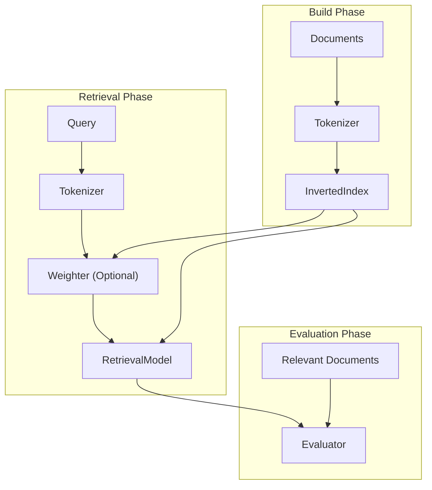

# NLP & IR Team Project

---

## Overview

This project implements and evaluates Information Retrieval (IR) models on both the CISI dataset and a sampled subset of KILT-Wikipedia.

The main goal is to extend classic IR models (Boolean, Vector Space Model) by incorporating document link structure and evaluating their performance.

---

## Documentation

- [Architecture](docs/architecture.md)
- [Interface Specification](docs/interface_specification.md)

## Dataset
- [CISI Dataset (Kaggle)](https://www.kaggle.com/datasets/dmaso01dsta/cisi-a-dataset-for-information-retrieval)
- [KILT-Wikipedia (Kaggle)](https://huggingface.co/datasets/facebook/kilt_wikipedia)
- [English Stopwords (Kaggle)](https://www.kaggle.com/datasets/amirhoseinsedaghati/english-stopwords)

---

## What This Project Does

- Builds a field-aware inverted index (title and body)
- Tokenizes and preprocesses documents and queries
- Computes TF-IDF weights for documents and queries
- Performs retrieval using:
  - Boolean Model
  - Vector Space Model (cosine similarity)
- Retrieves top-k relevant documents
- Evaluates performance using:
  - Precision@k
  - Recall@k
  - Average Precision (AP)
  - Mean Average Precision (MAP)

### Additional (KILT-Wikipedia)

- Streams large-scale Wikipedia dataset without full download
- Constructs internal hyperlink graph between documents
- Automatically selects seed documents based on out-degree
- Samples connected document subset using BFS
- Generates synthetic query/relevance pairs for evaluation

---

## How to Run

### Requirements (KILT-Wikipedia)

To use the KILT_Wikipedia dataset:
- Python 3.11 is recommended
- Hugging Face datasets may not work properly with newer versions (e.g., Python 3.14)
- Use a virtual environment

```bash
py -3.11 -m venv .venv
.\.venv\Scripts\Activate.ps1
pip install "datasets<4.0.0"
pip install numpy nltk
```

- The full KILT-Wikipedia dataset is ~66GB
- You should use ```--streaming``` to avoid downloading the entire dataset

### 1. Build Dataset

#### CISI

```bash
python build.py --dataset cisi --input data/CISI.ALL --output-prefix outputs/cisi
```

#### KILT-Wikipedia (recommended)
```bash
python build.py --dataset kilt --streaming
```

---

### 2. Evaluate (CISI)

#### VSM (recommended)
```bash
python evaluate.py --dataset cisi --model vsm --query-file data/CISI.QRY --rel-file data/CISI.REL
```
#### Boolean Model
```bash
python evaluate.py --dataset cisi --model boolean --query-file data/CISI.QRY --rel-file data/CISI.REL
```

---

### 3. Evaluate (KILT-Wikipedia)

#### VSM (recommended)
```bash
python evaluate.py --dataset kilt --model vsm
```

#### Boolean Model
```bash
python evlauate.py --dataset kilt --model boolean
```

---

## CLI Options

### build.py

#### Common Options

| Option | Type | Description |
|------|------|------------|
| `--dataset` | str | Dataset to build (`cisi`, `kilt`) |
| `--output-prefix` | str | Output file prefix (e.g., `outputs/kilt_500`) |

#### KILT Options

| Option | Type | Default | Description |
|------|------|--------|------------|
| `--target-size` | int | 500 | Target number of sampled documents (upper bound) |
| `--max-depth` | int | 2 | BFS depth for sampling |
| `--load-limit` | int | None | Number of streamed documents to load |
| `--num-auto-seeds` | int | 20 | Number of seed documents (based on out-degree) |
| `--streaming` | flag | False | Enable streaming mode (avoid full dataset download) |
| `--random-seed` | int | 42 | Random seed for reproducibility |
| `--seed-strategy` | str | `high_outdegree` | Seed selection (`high_outdegree`, `random`) |
| `--max-queries` | int | None | Maximum number of generated queries |

#### Tokenization Options

| Option | Type | Description |
|------|------|------------|
| `--remove-numbers` | flag | Remove numeric tokens |
| `--remove-stopwords` | flag | Remove stopwords |
| `--min-token-length` | int | Minimum token length |

---

### run_query.py

#### Common Opotions

| Option | Type | Default | Description |
|------|------|--------|------------|
| `--model` | str | `vsm` | Retrieval model (`vsm`, `boolean`) |
| `--index` | str | required | Path to index pickle file |
| `--query` | str | None | Direct query string |
| `--query-file` | str | None | Path to query file (e.g., CISI.QRY) |
| `--query-id` | int | None | Specific query ID from query file |
| `--random-query` | flag | False | Select a random query from query file |
| `--top-k` | int | 10 | Number of top results to return |

#### VSM Options

| Option | Type | Default | Description |
|------|------|--------|------------|
| `--title-weight` | float | 2.0 | Weight for title field |
| `--body-weight` | float | 1.0 | Weight for body field |
| `--no-log-tf` | flag | False | Disable log-scaled TF |
| `--no-smooth-idf` | flag | False | Disable smoothed IDF |

#### Tokenization Options

| Option | Type | Description |
|------|------|------------|
| `--remove-numbers` | flag | Remove numeric tokens |
| `--remove-stopwords` | flag | Remove stopwords |
| `--min-token-length` | int | Minimum token length |

#### Output Options

| Option | Type | Description |
|------|------|------------|
| `--explain` | flag | Show term-level contribution (VSM only) |
| `--show-body` | flag | Display document body snippet |

---

### evaluate.py

#### Common Opotions

| Option | Type | Default | Description |
|------|------|--------|------------|
| `--dataset` | str | `cisi` | Dataset to evaluate (`cisi`, `kilt`) |
| `--size` | int | 500 | Dataset size (used for file prefix) |
| `--model` | str | `vsm` | Retrieval model (`vsm`, `boolean`) |
| `--top-k` | int | 10 | Cutoff rank for evaluation |
| `--prefix` | str | None | Path prefix for dataset artifacts |
| `--save-csv` | flag | False | Save evaluation results to CSV |
| `--csv-path` | str | outputs/summary/all_results.csv | CSV output path |

#### VSM Options

| Option | Type | Default | Description |
|------|------|--------|------------|
| `--title-weight` | float | 2.0 | Weight for title field |
| `--body-weight` | float | 1.0 | Weight for body field |
| `--no-log-tf` | flag | False | Disable log-scaled TF |
| `--no-smooth-idf` | flag | False | Disable smoothed IDF |

#### Tokenization Options (Query)

| Option | Type | Description |
|------|------|------------|
| `--remove-numbers` | flag | Remove numeric tokens |
| `--remove-stopwords` | flag | Remove stopwords |
| `--min-token-length` | int | Minimum token length |

---

## Project Structure
```text
.
├── build.py
├── run_query.py
├── evaluate.py
├── docs/
│   ├── architecture.md
│   └── interface_specification.md
├── ir/
│   ├── datasets/
│   │   ├── cisi.py
│   │   └── kilt_wikipedia.py
│   ├── preprocessors/
│   │   └── tokenizer.py
│   ├── indexing/
│   │   └── inverted_index.py
│   ├── weighting/
│   │   └── tfidf.py
│   ├── models/
│   │   ├── vector_space_model.py
│   │   └── boolean_model.py
│   └── evaluator/
│       ├── metrics.py
│       └── evaluator.py
├── outputs/
```

---

## Pipeline

During the build phase, documents are tokenized and indexed using an inverted index.
In the retrieval phase, queries are processed and ranked using a TF-IDF based Vector Space Model.
Finally, the evaluation phase measures retrieval performance using metrics such as Precision, Recall, and MAP.

---

## Future Work

- Stemming / lemmatization
- BM25 ranking model
- Query expansion techniques
- Hyperparameter tuning (title/body weighting)
- Learning-to-rank approaches
- Semantic retrieval (e.g., embeddings, neural IR)

---

## Author
- Lee Jiho - [2j2h5](https://github.com/2j2h5)
- Choi Junwon - [junwon4158](https://github.com/junwon4158)
