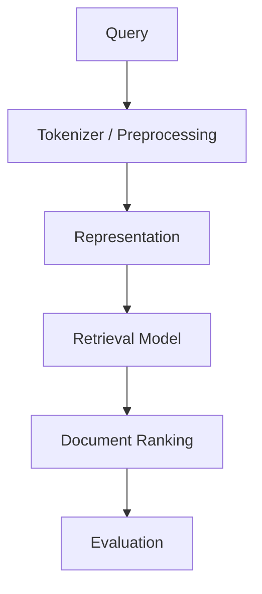

# NLP & IR Team Project

---

## Overview

This project implements and evaluates Information Retrieval (IR) models on both the CISI dataset and a sampled subset of KILT-Wikipedia.

The project initially focused on traditional retrieval approaches such as the Boolean Model, Vector Space Model (VSM), and Link-VSM, which incorporates hyperlink information between documents.

The current research direction extends beyond document link structures and investigates **Intent-VSM**, an intent-aware retrieval framework that utilizes semantic query representations and inferred user intent to improve retrieval performance.

The primary goal of the project is to compare traditional retrieval methods and intent-aware retrieval approaches under a unified evaluation framework.

---

## Documentation

- [Architecture](docs/architecture.md)
- [Interface Specification](docs/interface_specification.md)

---

## Dataset

- CISI Dataset
- KILT-Wikipedia
- English Stopwords

### CISI Dataset

Classical Information Retrieval benchmark dataset used for baseline experiments.

### KILT-Wikipedia

Large-scale Wikipedia dataset containing document hyperlinks.

Used for:

- Link-VSM experiments
- Intent-VSM experiments
- Large-scale retrieval evaluation

---

## What This Project Does

### Classical Retrieval

- Builds a field-aware inverted index
- Tokenizes and preprocesses documents and queries
- Computes TF-IDF weights
- Performs retrieval using:
  - Boolean Model
  - Vector Space Model (VSM)

### Link-Based Retrieval

- Constructs hyperlink graphs
- Computes Indegree scores
- Computes PageRank scores
- Combines text similarity and link importance
- Evaluates Link-VSM performance

### Intent-Aware Retrieval

- Generates semantic query embeddings
- Searches for semantically related queries
- Constructs intent representations
- Combines query information and inferred intent
- Evaluates Intent-VSM performance

### Evaluation

- Precision@k
- Recall@k
- Average Precision (AP)
- Mean Average Precision (MAP)
- F-score variants

---

## How to Run

### Requirements (KILT-Wikipedia)

To use the KILT-Wikipedia dataset:

- Python 3.11 is recommended
- Hugging Face datasets may not work properly with newer Python versions
- Use a virtual environment

```bash
py -3.11 -m venv .venv
.\.venv\Scripts\Activate.ps1

pip install "datasets<4.0.0"
pip install numpy nltk
```

For Intent-VSM experiments, additional embedding-related packages may be required depending on the current implementation.

---

### 1. Build Dataset

#### CISI

```bash
python build.py --dataset cisi --input data/CISI.ALL --output-prefix outputs/cisi
```

#### KILT-Wikipedia

```bash
python build.py --dataset kilt --target-size 500 --max-depth 2 --load-limit 100000 --num-auto-seeds 30 --max-queries 100 --streaming 
```

---

### 2. Evaluate (CISI)

#### VSM

```bash
python evaluate.py --dataset cisi --model vsm --query-file data/CISI.QRY --rel-file data/CISI.REL
```

#### Boolean Model

```bash
python evaluate.py --dataset cisi --model boolean --query-file data/CISI.QRY --rel-file data/CISI.REL
```

---

### 3. Evaluate (KILT-Wikipedia)

#### Link-VSM

```bash
python evaluate.py --dataset kilt --model link-vsm
```

#### VSM

```bash
python evaluate.py --dataset kilt --model vsm
```

#### Boolean Model

```bash
python evaluate.py --dataset kilt --model boolean
```

---

## CLI Options

### build.py

#### Common Options

| Option | Type | Description |
|------|------|------------|
| `--dataset` | str | Dataset to build (`cisi`, `kilt`) |
| `--output-prefix` | str | Output file prefix |

#### KILT Options

| Option | Type | Default | Description |
|------|------|--------|------------|
| `--target-size` | int | 500 | Target number of sampled documents |
| `--max-depth` | int | 2 | BFS depth |
| `--load-limit` | int | None | Number of streamed documents |
| `--num-auto-seeds` | int | 20 | Number of seed documents |
| `--streaming` | flag | False | Enable streaming mode |
| `--random-seed` | int | 42 | Random seed |
| `--seed-strategy` | str | high_outdegree | Seed selection strategy |
| `--max-queries` | int | None | Maximum generated queries |

---

### run_query.py

#### Common Options

| Option | Type | Default | Description |
|------|------|--------|------------|
| `--model` | str | vsm | Retrieval model |
| `--index` | str | required | Path to index file |
| `--query` | str | None | Query string |
| `--query-file` | str | None | Query file |
| `--query-id` | int | None | Query identifier |
| `--random-query` | flag | False | Random query selection |
| `--top-k` | int | 10 | Number of returned documents |

---

### evaluate.py

#### Common Options

| Option | Type | Default | Description |
|------|------|--------|------------|
| `--dataset` | str | cisi | Dataset to evaluate |
| `--size` | int | 500 | Dataset size |
| `--model` | str | vsm | Retrieval model |
| `--top-k` | int | 10 | Evaluation cutoff |
| `--prefix` | str | None | Dataset prefix |
| `--save-csv` | flag | False | Save results |
| `--csv-path` | str | outputs/summary/all_results.csv | CSV path |

---

## Project Structure

```text
.
├── build.py
├── run_query.py
├── evaluate.py
├── build_paragraph_embeddings.py
├── data/
│   ├── CISI.ALL
│   ├── CISI.QRY
│   ├── CISI.REL
│   └── stopwords.txt
├── docs/
│   ├── architecture.md
│   └── interface_specification.md
├── ir/
│   ├── datasets/
│   ├── evaluator/
│   ├── graph/
│   ├── indexing/
│   ├── models/
│   ├── preprocessors/
│   └── weighting/
```

---

## Pipeline



The retrieval stage may be implemented using Boolean retrieval, VSM, Link-VSM, or Intent-VSM depending on the experiment.

---

## Future Work

- BM25 ranking model
- Query expansion
- Hybrid sparse-dense retrieval
- Improved intent estimation
- Intent-aware ranking optimization
- Retrieval-Augmented Generation (RAG)
- Personalized retrieval
- Semantic interpretation of embedding spaces

---

## Author

- Lee Jiho - https://github.com/2j2h5
- Choi Junwon - https://github.com/junwon4158
