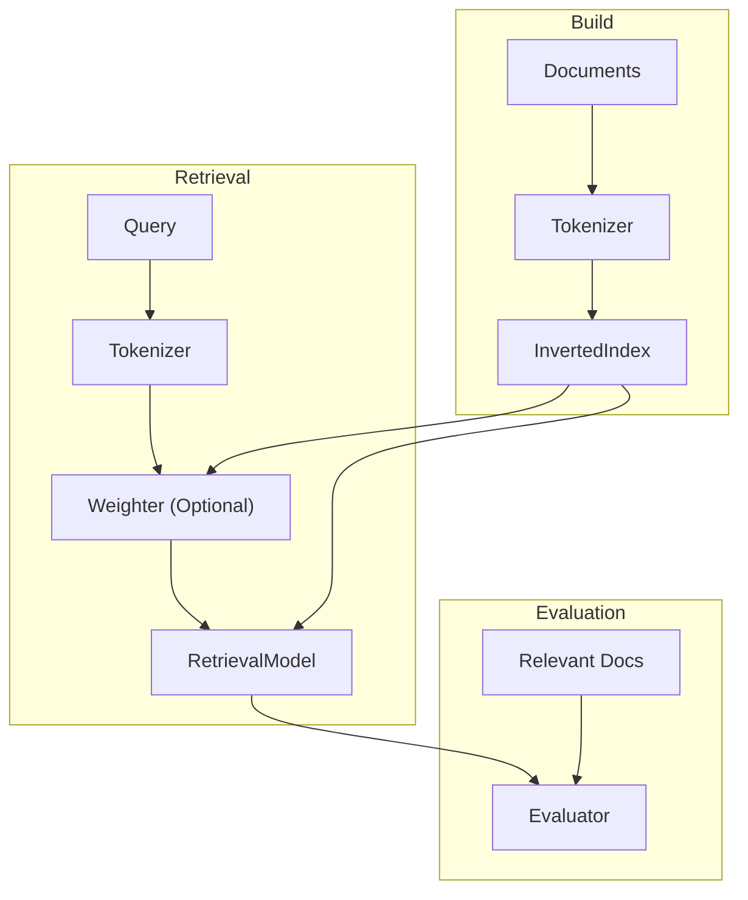

# System Architecture

---

## Overview

The system is composed of the following components:

- Tokenizer
- InvertedIndex
- Weighter (optional)
- RetrievalModel
- Evaluator

---

## Pipeline



---

## Components

### Tokenizer
- Converts text into tokens
- Used in indexing and query processing

### InvertedIndex
- Stores term → document mappings
- Maintains postings and document metadata

### Weighter (Optional)
- Converts TF into weighted vectors (e.g., TF-IDF)
- Used in ranked retrieval

### RetrievalModel
- Performs document retrieval

Supported:
- Boolean Model (exact match)
- Vector Space Model (ranked)

### Evaluator
- Measures retrieval performance (Precision, Recall, MAP)

---

## Data Flow

### Build
```
Documents → Tokenizer → InvertedIndex
```

### Retrieval
```
Query → Tokenizer → (Weighter) → RetrievalModel
                        ↑
                    InvertedIndex
```

### Evaluation
```
RetrievalModel → Evaluator ← Relevance
```