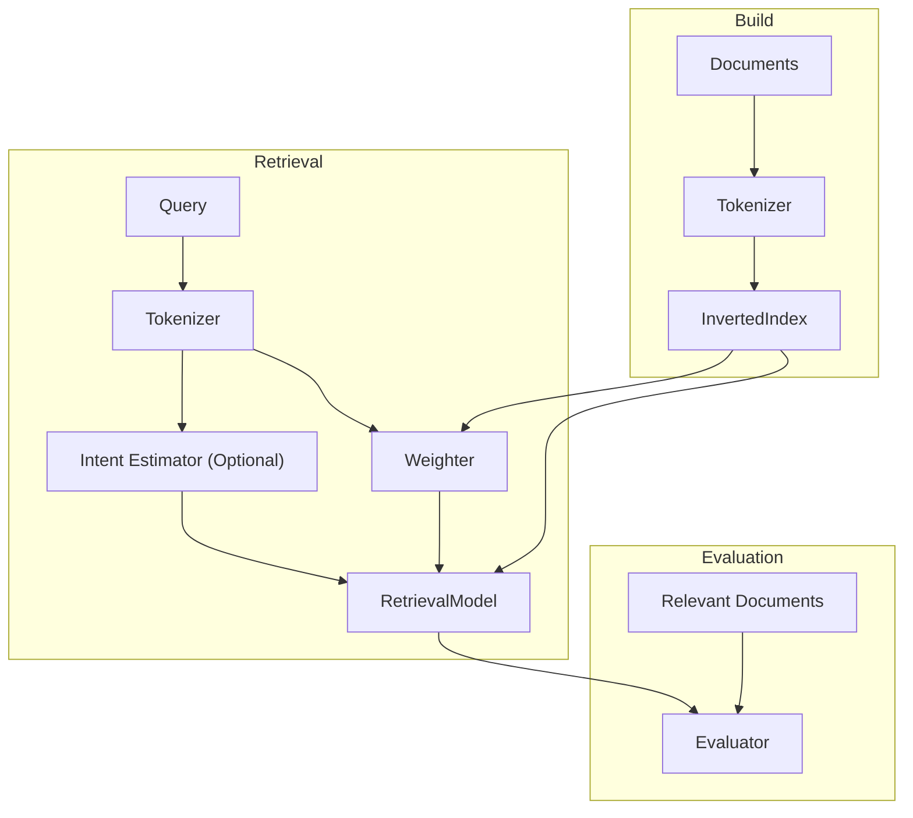

# System Architecture

---

## Overview

The system is designed as a modular Information Retrieval (IR) framework that supports both traditional retrieval models and intent-aware retrieval models.

The architecture consists of the following major components:

- Tokenizer
- InvertedIndex
- Weighter (optional)
- RetrievalModel
- Intent Estimator (optional)
- Evaluator

The system allows different retrieval models to share the same indexing and evaluation pipeline while enabling additional components such as hyperlink-based ranking and intent-aware ranking.

---

## Pipeline



---

## Components

### Tokenizer

Responsibilities:

- Converts raw text into normalized tokens
- Removes unnecessary tokens
- Supports both document and query processing

Used by:

- Index construction
- Query processing

---

### InvertedIndex

Responsibilities:

- Stores term → document mappings
- Maintains document statistics
- Provides postings for retrieval models

Used by:

- VSM
- Link-VSM
- Intent-VSM

---

### Weighter (Optional)

Responsibilities:

- Converts term frequencies into weighted vectors
- Supports TF-IDF based retrieval

Examples:

- TF-IDF

---

### Intent Estimator (Optional)

Responsibilities:

- Generates semantic query representations
- Searches for semantically related queries
- Constructs intent vectors
- Provides intent information to retrieval models

Used by:

- Intent-VSM

---

### RetrievalModel

Responsibilities:

- Computes document relevance scores
- Produces ranked document lists

Supported models:

- Boolean Model
- Vector Space Model (VSM)
- Link-VSM
- Intent-VSM

---

### Evaluator

Responsibilities:

- Measures retrieval performance
- Produces aggregate evaluation metrics

Supported metrics:

- Precision@k
- Recall@k
- F-score
- MAP

---

## Data Flow

### Build

```text
Documents
    ↓
Tokenizer
    ↓
InvertedIndex
```

### Classical Retrieval

```text
Query
    ↓
Tokenizer
    ↓
Weighter
    ↓
RetrievalModel
```

### Intent-Aware Retrieval

```text
Query
    ↓
Tokenizer
    ↓
Intent Estimator
    ↓
Intent Vector
    ↓
RetrievalModel
```

### Evaluation

```text
Retrieval Results
        ↓
     Evaluator
        ↑
 Relevant Documents
```
